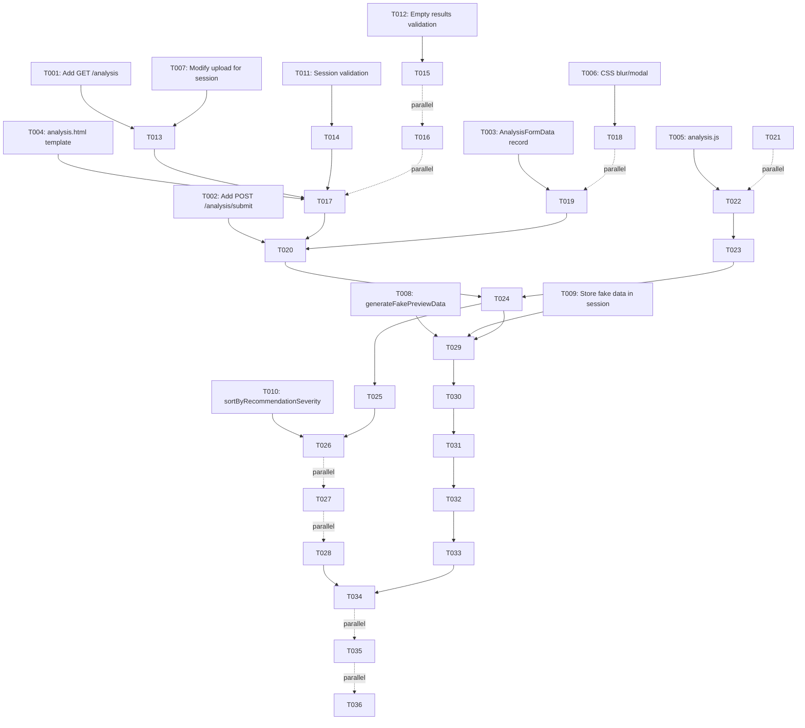

# Implementation Tasks: Analysis Page with Results

**Feature**: 005-analysis-page
**Branch**: `005-analysis-page`
**Spec**: [spec.md](spec.md) | **Plan**: [plan.md](plan.md)
**Created**: 2026-02-17

## Task Summary

**Total Tasks**: 36
**P1 User Stories**: 3 (US1, US3, US4)
**P2 User Stories**: 1 (US2)
**Phases**: 5 (Setup, Foundational, US1+US3+US4, US2, Polish)

## Implementation Strategy

**MVP-First Approach**:
1. **Phase 1-2**: Setup + Session management (blocking prerequisites)
2. **Phase 3**: US1 (Navigation) + US3 (Form submission) + US4 (Results display) - Core flow
3. **Phase 4**: US2 (Blur/fake data preview) - Enhancement
4. **Phase 5**: Polish (validation, error handling, accessibility)

**Parallel Execution**: Tasks marked `[P]` can run concurrently

---

## Phase 1: Setup & Configuration

**Purpose**: Initialize project structure, dependencies, and routing

- [ ] T001 Add GET `/analysis` endpoint to JavaVersionResource.java
- [ ] T002 Add POST `/analysis/submit` endpoint to JavaVersionResource.java
- [ ] T003 [P] Create AnalysisFormData record in src/main/java/com/github/asm0dey/AnalysisFormData.java
- [ ] T004 [P] Create analysis.html Qute template in src/main/resources/templates/JavaVersionResource/analysis.html
- [ ] T005 [P] Create analysis.js in src/main/resources/META-INF/resources/js/analysis.js
- [ ] T006 [P] Add CSS for blur effect and modal to src/main/resources/META-INF/resources/css/theme.css

---

## Phase 2: Foundational - Session Management & Data Flow

**Purpose**: Implement session storage and fake data generation (blocks all user stories)

- [ ] T007 Modify POST `/upload` endpoint to store analysis results in HTTP session
- [ ] T008 Implement generateFakePreviewData() method in JavaVersionService.java
- [ ] T009 Modify POST `/upload` to generate and store fake preview data in session
- [ ] T010 Implement sortByRecommendationSeverity() method in JavaVersionService.java
- [ ] T011 Add session validation helper method to check if analysisResults exist
- [ ] T012 Implement empty results validation in POST `/upload` endpoint per FR-015

---

## Phase 3: P1 User Stories (Core Flow)

### User Story 1: Navigate to Analysis from Data Input

**Depends on**: Phase 2 (session management)

- [ ] T013 [US1] Implement GET `/analysis` endpoint to retrieve session data
- [ ] T014 [US1] Add session expiration check and redirect logic in GET `/analysis`
- [ ] T015 [US1] Modify upload success page to add "View Analysis Results" button per FR-021
- [ ] T016 [US1] Implement loading indicator in analysis.html per FR-019

### User Story 3: Complete Assessment Form to Reveal Results

**Depends on**: T013-T016 (analysis page must exist)

- [ ] T017 [US3] Add form HTML to analysis.html with email, companyName, role fields
- [ ] T018 [US3] Style form as centered overlay modal (600px, z-index 1000) per FR-006
- [ ] T019 [US3] Implement AnalysisFormData validation annotations (@Email, @NotBlank)
- [ ] T020 [US3] Implement POST `/analysis/submit` endpoint with form validation
- [ ] T021 [US3] Add inline error display logic in analysis.js per FR-020
- [ ] T022 [US3] Implement form submission handler in analysis.js
- [ ] T023 [US3] Add submit button disable logic after successful submission per FR-017
- [ ] T024 [US3] Implement table reveal logic (hide fake, show real) in analysis.js

### User Story 4: Understand Analysis Results

**Depends on**: T024 (results must be revealable)

- [ ] T025 [US4] Render real results table in analysis.html with all FR-010 columns
- [ ] T026 [US4] Apply sortByRecommendationSeverity() to results before rendering per FR-018
- [ ] T027 [US4] Add license explanations display per FR-013
- [ ] T028 [US4] Format EOL dates consistently per FR-014

---

## Phase 4: P2 User Stories (Enhancement)

### User Story 2: View Blurred Placeholder Before Assessment Form

**Depends on**: T017-T024 (form and reveal mechanism must exist)

- [ ] T029 [US2] Render fake preview table in analysis.html (initially visible)
- [ ] T030 [US2] Apply blur CSS filter (8px) to fake preview table per research.md
- [ ] T031 [US2] Add pointer-events: none and user-select: none to blurred table
- [ ] T032 [US2] Hide real results table initially (display: none or hidden class)
- [ ] T033 [US2] Verify fake data matches row count of real data

---

## Phase 5: Polish & Cross-Cutting Concerns

**Purpose**: Testing, error handling, validation refinement

- [ ] T034 [P] Write integration test for GET `/analysis` in AnalysisPageTest.java
- [ ] T035 [P] Write integration test for POST `/analysis/submit` with valid/invalid data in AnalysisPageTest.java
- [ ] T036 [P] Write unit tests for AnalysisFormData validation in AnalysisFormValidationTest.java

---

## Dependencies



## Story Dependencies

- **US1** (Navigate): Independent (depends only on Phase 2)
- **US3** (Form): Depends on US1 (analysis page must exist)
- **US4** (Results): Depends on US3 (reveal mechanism must exist)
- **US2** (Blur): Depends on US3 and US4 (form and reveal must work first)

## Parallel Execution Examples

**After Phase 2 completes, parallelize Phase 3 setup**:
```bash
# Terminal 1: Backend endpoints
git checkout 005-analysis-page
# Work on T013-T014 (GET /analysis implementation)

# Terminal 2: Frontend templates
# Work on T015-T016 (button + loading indicator)

# Terminal 3: Form structure
# Work on T017-T018 (form HTML + modal CSS)
```

**During US3 implementation, parallelize validation**:
```bash
# Terminal 1: Backend validation
# Work on T019-T020 (AnalysisFormData + endpoint)

# Terminal 2: Frontend validation
# Work on T021-T022 (error display + submission)

# Terminal 3: JavaScript interactions
# Work on T023-T024 (button disable + reveal)
```

**Phase 5 testing (all parallelizable)**:
```bash
# Terminal 1
# Work on T034 (GET /analysis tests)

# Terminal 2
# Work on T035 (POST /analysis/submit tests)

# Terminal 3
# Work on T036 (Form validation unit tests)
```

---

## Validation Checklist

Before marking feature complete, verify:

- [ ] All 4 user stories have passing acceptance tests
- [ ] Session management handles expiration gracefully
- [ ] Form validation works for all fields (email format, required fields)
- [ ] Fake data is visually indistinguishable from real data when blurred
- [ ] Real data is hidden until form submission
- [ ] Table sorting by severity works correctly
- [ ] Submit button disables after successful submission
- [ ] "View Analysis Results" button appears on upload success
- [ ] Loading indicator appears briefly on analysis page load
- [ ] All FR requirements (FR-001 through FR-021) are implemented
- [ ] Constitution Principle III (Defensive Data Handling) validated
- [ ] Constitution Principle V (Test Coverage) achieved for new endpoints

---

## Implementation Notes

### Session Management
- Use Jakarta Servlet HttpSession (already available in Quarkus)
- Session attributes: `analysisResults`, `fakePreviewData`, `formSubmitted`
- Default session timeout: 30 minutes (configurable)

### Fake Data Generation
- Generate in JavaVersionService.generateFakePreviewData()
- Use "XX.X.XX" for versions, "XXXX" for text fields
- Match row count of real data for consistent table structure

### Form Validation
- Backend: Jakarta Bean Validation (@Email, @NotBlank)
- Frontend: HTML5 validation + JavaScript custom validation
- Error messages per FR-007: "Please enter a valid email address"

### Blur Effect
- CSS: `filter: blur(8px); pointer-events: none; user-select: none;`
- Applied to fake preview table initially
- Removed when real table is revealed

### Testing Strategy
- Integration tests: Full request/response cycle with REST Assured
- Unit tests: Form validation logic in isolation
- Test data: Reuse existing test-data/ properties files
- Coverage target: 100% of new endpoints per Constitution Principle V

---

**Next Step**: Begin implementation with Phase 1 (T001-T006)
**Estimated Effort**: 3-5 days (depends on team size and parallel execution)
